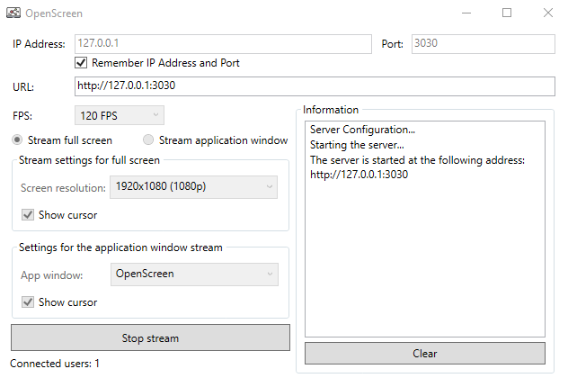
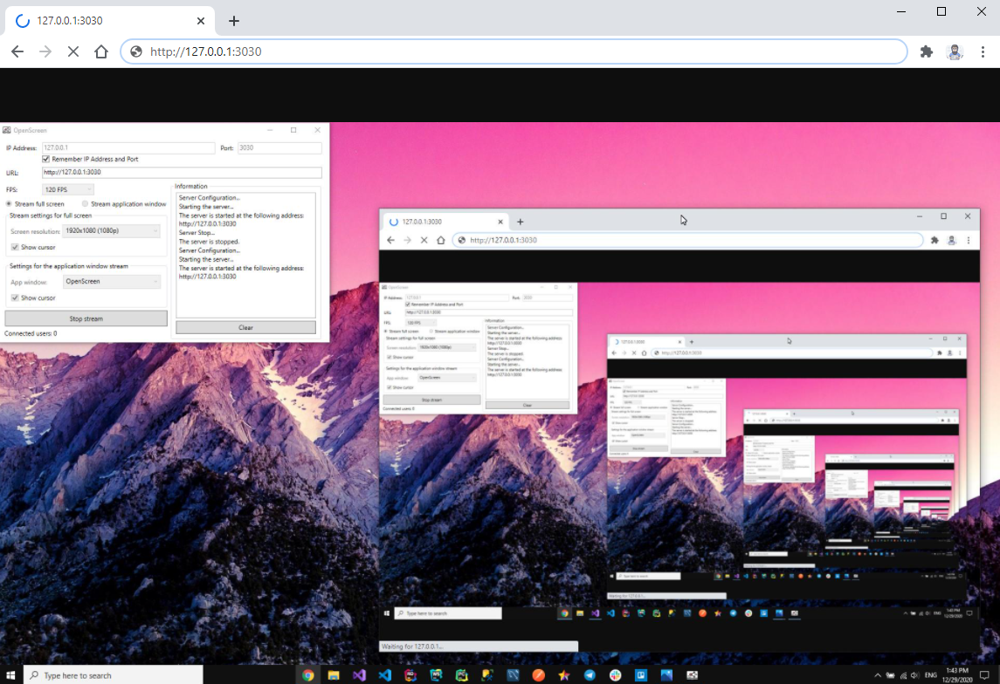

[![Contributors][contributors-shield]][contributors-url]
[![Forks][forks-shield]][forks-url]
[![Stargazers][stars-shield]][stars-url]
[![Issues][issues-shield]][issues-url]
[![MIT License][license-shield]][license-url]


<!-- PROJECT LOGO -->
<br />
<p align="center">
  <a href="https://github.com/MrKonstantinSh/OpenScreen">
    
  </a>

  <h3 align="center">OpenScreen</h3>

  <p align="center">
    Desktop application for screen sharing over the network!
    <br />    
    <br />
    <a href="https://github.com/MrKonstantinSh/OpenScreen/releases">Releases</a>
    ·
    <a href="https://github.com/MrKonstantinSh/OpenScreen/issues">Report Bug</a>
    ·
    <a href="https://github.com/MrKonstantinSh/OpenScreen/issues">Request Feature</a>
  </p>
</p>


<!-- TABLE OF CONTENTS -->
## Table of Contents

* [About the Project](#about-the-project)
  * [Built With](#built-with)
* [Getting Started](#getting-started)
  * [Installation](#installation)
* [Roadmap](#roadmap)
* [Contributing](#contributing)
* [License](#license)
* [Contact](#contact)


<!-- ABOUT THE PROJECT -->
## About The Project
Screenshots of a running application:

<p align="center">
  
  
</p>

**OpenScreen** is a desktop application that allows you to show your screen to friends and colleagues.

**Features:**
* You can show the whole screen
* You can show the window of a specific application
* You are viewing a demo in a browser -> you can do it from a computer, tablet or phone
* You can enable/disable the display of the cursor when demonstrating the screen/application window
* You can choose the quality of the screen demonstration
* You can change the FPS

### Built With
* [Visual Studio 2019](https://visualstudio.microsoft.com/vs/)
* [.NET Framework 4.7.2](https://dotnet.microsoft.com/download/dotnet-framework/net472)
* [C# 7.3](https://docs.microsoft.com/en-us/dotnet/csharp/whats-new/csharp-7-3)


<!-- GETTING STARTED -->
## Getting Started

### Installation

1. Clone the repo
```sh
> git clone https://github.com/MrKonstantinSh/OpenScreen.git
```
2. Go to the project folder
```sh
> cd ./ProjectFolder
```

**OR**

DOWNLOAD [OpenScreen-Installer.msi](https://github.com/MrKonstantinSh/OpenScreen/releases/download/v1.1/OpenScreen-Installer.msi)

<!-- ROADMAP -->
## Roadmap

See the [open issues](https://github.com/MrKonstantinSh/OpenScreen/issues) for a list of proposed features (and known issues).


<!-- CONTRIBUTING -->
## Contributing

Contributions are what make the open source community such an amazing place to be learn, inspire, and create. Any contributions you make are **greatly appreciated**.

1. Fork the Project
2. Create your Feature Branch (`git checkout -b feature/AmazingFeature`)
3. Commit your Changes (`git commit -m 'Add some AmazingFeature'`)
4. Push to the Branch (`git push origin feature/AmazingFeature`)
5. Open a Pull Request


<!-- LICENSE -->
## License

Distributed under the MIT License. See [LICENSE](https://github.com/MrKonstantinSh/OpenScreen/blob/master/LICENSE) for more information.


<!-- CONTACT -->
## Contact

Shulga Konstantin - mrkonstantinsh@gmail.com

Project Link: [https://github.com/MrKonstantinSh/OpenScreen](https://github.com/MrKonstantinSh/OpenScreen)


[contributors-shield]: https://img.shields.io/github/contributors/MrKonstantinSh/OpenScreen.svg?style=flat-square
[contributors-url]: https://github.com/MrKonstantinSh/OpenScreen/graphs/contributors
[forks-shield]: https://img.shields.io/github/forks/MrKonstantinSh/OpenScreen.svg?style=flat-square
[forks-url]: https://github.com/MrKonstantinSh/OpenScreen/network/members
[stars-shield]: https://img.shields.io/github/stars/MrKonstantinSh/OpenScreen.svg?style=flat-square
[stars-url]: https://github.com/MrKonstantinSh/OpenScreen/stargazers
[issues-shield]: https://img.shields.io/github/issues/MrKonstantinSh/OpenScreen.svg?style=flat-square
[issues-url]: https://github.com/MrKonstantinSh/OpenScreen/issues
[license-shield]: https://img.shields.io/github/license/MrKonstantinSh/OpenScreen.svg?style=flat-square
[license-url]: https://github.com/MrKonstantinSh/OpenScreen/blob/master/LICENSE

